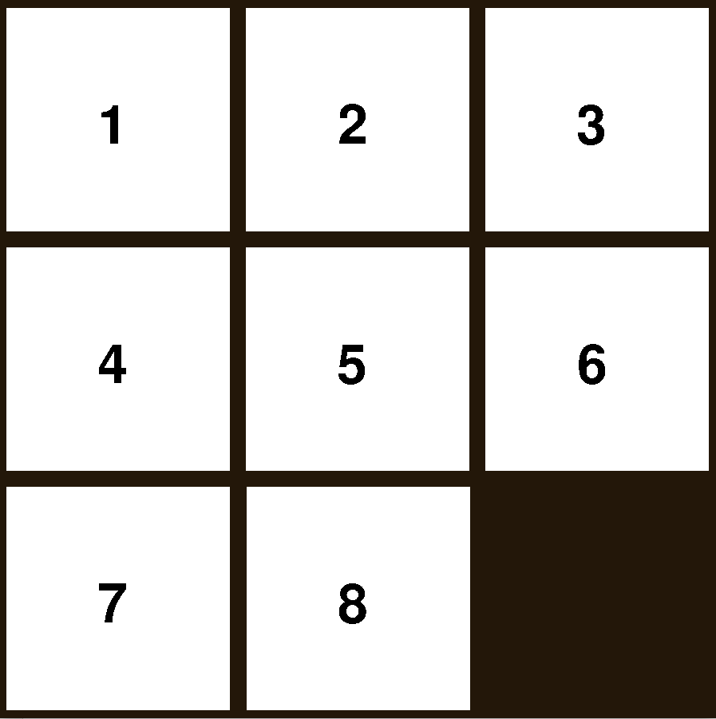
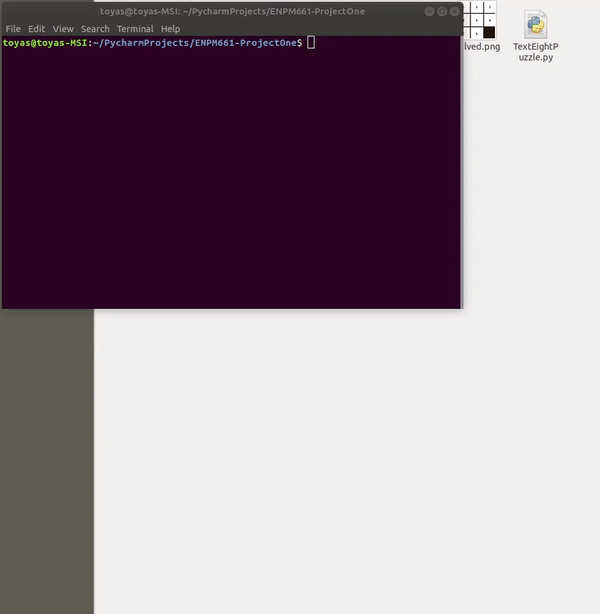

# ENPM661-ProjectOne: 8-Puzzle Problem

## Overview

8 Puzzle problem is a puzzle game made of 3x3 grid consisting of 8 blocks numbered from 1 to 8 and one empty space.
Blocks can be slided into the empty space, do so we can manipulate the oriantation of the blocks. Goal is to get a specific
orientaion of blocks as shown in the figure.



There are 3 files
- TextEightPuzzle.py
- GraphicalEightPuzzle.py
- AStar.py
 
AStar.py is the file which has implementatioon of 8 Puzzle problem solver.

TextEightPuzzle.py uses the AStar.py to solve the problem and create required text files as output.

GraphicalEightPuzzle.py uses the AStar.py to solve the problem and creates animation for solution 
from given state to goal state.

## Demo Steps

Text base-

```
python TextEightPuzzle.py
0 1 2 3 4 5 6 7 8
```

Graphics base-

```
python GraphicalEightPuzzle.py
0 1 2 3 4 5 6 7 8
```

## Dependencies

Text base-

-  Numpy

Graphics base-

- Numpy
- PyGame

## Result

Text base-

Three files are genrated-
nodePath.txt- Contains the path form initial state to goal state.
Nodes.txt- Contains all the explored nodes.
NodesInfo.txt- Contain index of the node and its parent.

Graphics base-

